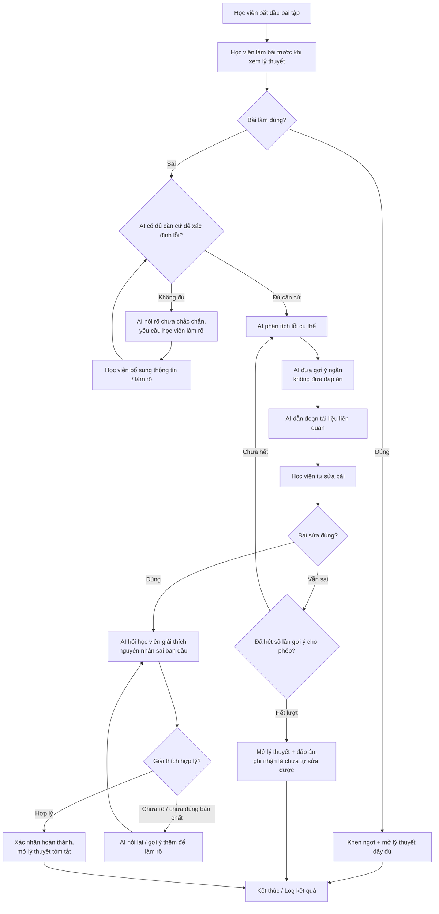

# Luồng hoạt động — Học từ lỗi trước

## 1. Sơ đồ tổng quan

## 2. Mô tả từng bước

| Bước | Vai trò | Input | Output | Ghi chú |
|---|---|---|---|---|
| 1. Làm bài trước lý thuyết | Học viên | Đề bài | Bài làm | Chưa xem lý thuyết |
| 2. Chấm đúng/sai | Hệ thống | Bài làm, đáp án chuẩn | Đúng / Sai | Chấm tự động hoặc theo rubric |
| 3. Kiểm tra căn cứ | AI | Bài làm sai, dữ liệu liên quan | Đủ / Không đủ căn cứ | Theo nguyên tắc "không suy đoán khi thiếu dữ liệu" |
| 4. Phân tích lỗi | AI | Bài làm sai, đáp án, tài liệu | Loại lỗi cụ thể | Không phải "sai/đúng" chung chung |
| 5. Gợi ý ngắn | AI | Loại lỗi | 1 gợi ý ngắn, không phải đáp án | Tăng dần mức độ chi tiết theo số lần thử |
| 6. Dẫn tài liệu | AI | Loại lỗi | Đoạn tài liệu liên quan (trích dẫn vị trí) | Bắt buộc dẫn nguồn |
| 7. Tự sửa | Học viên | Gợi ý + tài liệu | Bài sửa | Học viên có quyền bỏ qua hoặc hỏi lại |
| 8. Kiểm tra bài sửa | Hệ thống/AI | Bài sửa | Đúng / Sai | Nếu sai và còn lượt → quay lại bước 4 |
| 9. Kiểm tra giải thích | AI | Câu giải thích của học viên | Hợp lý / Chưa hợp lý | Đây là điểm khác biệt cốt lõi so với "chỉ xem đáp án" |
| 10. Kết thúc | Hệ thống | Kết quả toàn bộ luồng | Log + hiển thị lý thuyết | Dùng để đo các chỉ số ở mục 8 tổng quan dự án |

## 3. Các điều kiện dừng / giới hạn cần chốt trong spec
- Số lần gợi ý tối đa trước khi mở đáp án (đề xuất: 2–3 lần).
- Ngưỡng để AI coi là "đủ căn cứ" để phân tích lỗi.
- Cách đánh giá "giải thích hợp lý" (rubric hay AI chấm tự do).
- Cách log dữ liệu phục vụ đo lường ở mục 8 (không chứa dữ liệu cá nhân/dữ liệu gốc khóa học, theo mục 11 phạm vi không làm).
