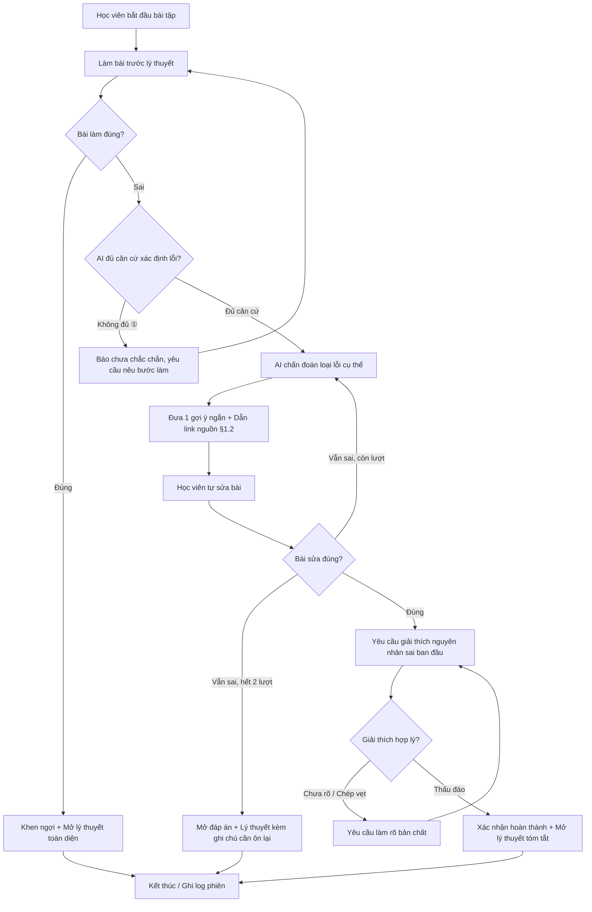

# Spec — Học từ lỗi trước (Prototype)

## 1. Phạm vi prototype
Một bài học, một dạng bài, một luồng xử lý lỗi duy nhất. Không xử lý nhiều chương, không chấm điểm chính thức, không tự động đưa đáp án ngay khi sai.

**Bài tập cụ thể:** Ước tính số token và chi phí API cho một tập dữ liệu tiếng Việt (Tokenization tiếng Việt — §1 & §2 giáo trình).

**Non-goals:**
1. Không xây dựng hệ thống quản lý nhiều chương/nhiều môn học phức tạp.
2. Không chấm điểm xếp loại học tập chính thức hay thi cử.
3. Không tự động cung cấp lời giải hoàn chỉnh ngay sau lần nộp đầu tiên.
4. Không lưu trữ thông tin định danh cá nhân (PII) của học viên.

## 2. Đối tượng dữ liệu

| Đối tượng | Trường chính | Mô tả |
|---|---|---|
| `Exercise` | id, đề bài, đáp án chuẩn, rubric chấm | Bài tập duy nhất: ước tính token tiếng Việt và chi phí API |
| `Document` | id, tiêu đề, nội dung, section id | Nguồn để AI trích dẫn: §1.1 (Token là gì), §1.2 (Tokenization tiếng Việt/BPE), §2.1 (Cách tính chi phí API) |
| `Attempt` | id, bài làm, đúng/sai, lần thứ mấy | Lượt làm đầu và lượt sửa (tối đa 2 lượt gợi ý) |
| `ErrorAnalysis` | attempt_id, loại lỗi, độ tin cậy, căn cứ | Kết quả phân tích lỗi: Lớp 1 (Khái niệm sai), Lớp 2 (Công thức sai), Lớp 3 (Mơ hồ/Thiếu căn cứ), Lớp 4 (Kiểm tra bản chất) |
| `Hint` | attempt_id, nội dung, document_ref | Gợi ý ngắn gắn với mã section tài liệu (`§1.2`, `§2.1`), không lộ đáp án |
| `Explanation` | attempt_id, nội dung, đánh giá | Kiểm tra học viên giải thích đúng nguyên nhân sai (phân biệt thấu đáo vs. chép vẹt) |
| `SessionLog` | session_id, các bước, thời gian, kết quả | Log ẩn danh để đo lường; không lưu tên hoặc dữ liệu cá nhân |

## 3. Các bước xử lý AI

1. **Chấm bài** theo đáp án chuẩn hoặc rubric; chấp nhận dung sai kết quả khi học viên dùng hệ số token tiếng Việt hợp lệ (2.0–3.0 token/từ).
2. **Kiểm tra đủ căn cứ** từ đề bài, đáp án, bài làm và tài liệu — nếu bài làm mơ hồ (ký tự rác, đoán cảm tính) thì chuyển nhánh Lớp 3: báo "chưa đủ căn cứ", yêu cầu học viên trình bày bước tính (HAX G10).
3. **Phân tích loại lỗi cụ thể**: Lớp 1 (Khái niệm sai lệch — nhầm 1 từ = 1 token, áp sai hệ số tiếng Anh), Lớp 2 (Lỗi công thức & đơn vị — sai mẫu số 1M, quên nhân số câu).
4. **Sinh một gợi ý ngắn**, không lộ kết quả số cuối, chỉ mở đúng hướng tư duy.
5. **Trích dẫn đoạn tài liệu** có mã section tương ứng (`§1.2` cho lỗi khái niệm, `§2.1` cho lỗi công thức).
6. **Kiểm tra bài sửa**: nếu vẫn sai và còn lượt thì lặp lại từ bước 3; nếu hết 2 lượt thì mở đáp án + lý thuyết kèm ghi chú cần ôn lại.
7. **Kiểm tra học viên giải thích đúng nguyên nhân sai** (Lớp 4 — Reflection): phân biệt câu trả lời thấu đáo và câu trả lời chép vẹt/đổ lỗi công cụ.
8. **Ghi log phiên học ẩn danh**: trạng thái, số lượt gợi ý, kết quả; không lưu dữ liệu cá nhân.

## 4. Thiết kế prototype và giới hạn

### Mức prototype: Working Prototype

Prototype mức **Working Prototype** cho phép người dùng đi hết luồng một bài tập từ làm bài, nhận phản hồi AI thật, xem gợi ý và tự sửa; tích hợp Gemini 2.5 Flash; fallback offline fixture khi mất kết nối/hết quota API.

| Thành phần | Trạng thái | Mô tả |
|---|---|---|
| Màn hình bài tập, nhập bài, nộp và sửa | Chạy thực tế | Giao diện web tương tác thời gian thực; người dùng đi qua được toàn bộ flow. |
| Một bài tập và tài liệu | Chạy thực tế | 1 bài tập chuẩn (Tokenization tiếng Việt) và 3 sections tài liệu lý thuyết trích dẫn (§1.1, §1.2, §2.1). |
| Kiểm tra đúng/sai | Chạy thực tế | Dùng đáp án hoặc rubric cố định; chấp nhận dung sai hệ số token 2.0–3.0. |
| Phân tích lỗi, gợi ý, yêu cầu giải thích | AI thật (Gemini 2.5 Flash) | Gọi API mô hình ngôn ngữ lớn; phân tích lỗi động theo 4 lớp; fallback offline fixture khi mất mạng. |
| Trích dẫn tài liệu | Fixture thật | AI phải chọn đúng mã section tài liệu tương ứng với loại lỗi (`§1.2` hoặc `§2.1`). |
| Log phiên học | Chạy thực tế tối thiểu | Không lưu tên hoặc dữ liệu cá nhân (PII). |

**Automation:** `Conditional` — Nếu AI đoán bừa loại lỗi khi bài làm quá mơ hồ (cost-of-error cao), hệ thống từ chối đưa gợi ý, thông báo "chưa đủ căn cứ" và yêu cầu học viên nêu rõ bước tính toán (HAX G10).

Tham số: `MAX_HINTS` tối đa 2 lượt; `CONFIDENCE_THRESHOLD` yêu cầu đủ căn cứ; `EXPLANATION_RUBRIC` yêu cầu nêu đúng nguyên nhân sai, không chỉ chép đáp án.

## 5. Chỉ số đo lường

| Chỉ số | Cách đo | Kết quả thực tế (CP4) |
|---|---|---|
| Độ chính xác xác định lỗi | So sánh với nhãn golden set | **10/10 (100%)** — Lớp 1 (TC-01, TC-02): ✅ `§1.2`; Lớp 2 (TC-03, TC-04): ✅ `§2.1` |
| Tỷ lệ tự sửa | Số lượt sửa đúng / tổng lượt sai | Đo qua Happy path (TC-07, TC-08): **2/2** nhận diện đúng `correct` |
| Tỷ lệ giải thích đúng | Số giải thích hợp lý / số lượt sửa đúng | Reflection (TC-09 thấu đáo ✅, TC-10 chép vẹt ✅): **2/2 phân biệt đúng** |
| Độ chính xác trích dẫn | Kiểm tra đoạn AI dẫn có liên quan | **4/4 (100%)** — TC-01,02 → `§1.2`; TC-03,04 → `§2.1`; 0% lộ đáp án số |
| Thời gian sửa và hiểu | Từ lần sai đầu đến lần sửa đúng | Chưa đo (cần willing user test thực tế) |

**Tổng kết chạy tự động (18/9/2026 — Gemini 2.5 Flash):** `10/10 cases đạt (100%)` — vượt Quality Bar 65%. Chi tiết: [`eval/test_report.json`](eval/test_report.json).

## 6. Golden set và HAX/PAIR

Golden set gồm **22 cases** (`eval/golden_set.json`) phủ kín 4 lớp chỗ khó: Lớp 1 (4 cases — khái niệm sai lệch), Lớp 2 (3 cases — lỗi công thức & đơn vị), Lớp 3 (4 cases — mơ hồ/thiếu căn cứ), Lớp 4 (4 cases — kiểm tra bản chất), Happy path & Cases hiếm (7 cases). Mỗi case có loại lỗi, gợi ý mong đợi, đoạn tài liệu đúng và hành vi khi AI không đủ căn cứ.

**Quality bar:** ≥ 65% ca qua bộ test tự động 22 cases; 100% không lộ đáp án ở gợi ý; 100% ca thiếu căn cứ không bị AI bịa đặt.

**Kết quả thực tế:** Lần 1 (Offline Mock — regex & rules): 20/20 (100%); Lần 2 (Gemini 2.5 Flash CP3 — LLM thật): 15/22 (68.2%) — vượt ngưỡng Quality Bar.

| Nguyên tắc | Cách áp dụng | Vị trí |
|---|---|---|
| **G1 — Làm rõ hệ thống làm được gì** | Banner thông báo ngay đầu màn hình: nêu rõ đây là bài luyện tập tự học, AI đóng vai trò gia sư gợi mở tư duy, không phải hệ thống chấm thi chính thức. | Màn hình bắt đầu bài tập. |
| **G2 — Làm rõ hệ thống làm tốt đến đâu** | Khi bắt lỗi, AI ghi rõ căn cứ phân tích và dẫn mã đoạn tài liệu cụ thể (`[§1.2]`); khi thiếu dữ kiện, thừa nhận "chưa đủ căn cứ" thay vì đoán mò. | Phản hồi sau khi làm sai, bước 3–6. |
| **G9 — Sửa dễ dàng** | Hộp nhập bài sửa hiển thị trực tiếp ngay dưới nhận xét của AI; học viên bấm "Nộp bài sửa" để kiểm tra tức thì mà không cần reload trang hay làm lại từ đầu. | Nút Sửa bài và vòng lặp sửa bài. |
| **G10 — Thu hẹp phạm vi khi nghi ngờ** | Với các câu trả lời vô nghĩa (`asdf`, cảm tính, bỏ cuộc), AI dừng luồng gợi ý, yêu cầu học viên cung cấp bước giải hoặc cho phép mở tài liệu để tra cứu. | Nhánh Không đủ căn cứ và nhánh hết lượt gợi ý. |

## 7. Việc chưa hoàn thành

- [ ] Chốt rubric bài tập.
- [ ] Chốt rubric giải thích.
- [ ] Hoàn thiện golden set.
- [ ] Thiết kế giao diện gợi ý và trích dẫn.
- [ ] Test với ít nhất 2 willing user.

## 8. Ràng buộc

- Chỉ làm một bài và một dạng bài trong prototype.
- Không chấm điểm chính thức.
- Không đưa dữ liệu cá nhân hoặc dữ liệu gốc vào repo công khai.

## 9. Luồng hoạt động chi tiết

**Các nhánh trải nghiệm:**
- **Happy path:** Nộp đúng ngay lần đầu → AI chúc mừng, phân tích ngắn gọn lý do đúng, mở khóa tài liệu lý thuyết hoàn chỉnh.
- **Không căn cứ (①):** Bài làm là ký tự ngẫu nhiên hoặc thể hiện bỏ cuộc → AI thông báo chưa đủ dữ liệu, hướng dẫn học viên đọc đoạn tài liệu nền tảng.
- **Low-confidence (②):** Bài làm có số đúng nhưng thiếu phép tính trung gian → AI yêu cầu bổ sung cách tính trước khi đưa nhận xét.
- **Correction:** Sau gợi ý lần 1, sửa đúng → Kích hoạt bước hỏi giải thích nguyên nhân sai.
- **Ngoài phạm vi (③):** Hỏi lạc đề (ví dụ: code Python) → AI từ chối lịch sự và hướng quay lại bài toán token tiếng Việt.
- **Domain đặc thù (④):** Dùng hệ số token dao động hợp lý (2.0–3.0 token/từ tiếng Việt) → Hệ thống chấp nhận dung sai kết quả.

### Điều kiện dừng

- **Tối đa 2 lượt gợi ý** (`MAX_HINTS = 2`) trước khi mở đáp án và lý thuyết kèm ghi chú cần ôn lại.
- **Thiếu căn cứ** (Lớp 3 — bài làm mơ hồ, ký tự rác, cảm tính, bỏ cuộc): báo rõ "chưa đủ căn cứ", không đoán mò, yêu cầu học viên trình bày bước tính hoặc cho phép mở tài liệu tra cứu.
- **Giải thích chưa hợp lý hoặc chép vẹt** (Lớp 4): không duyệt, yêu cầu học viên giải thích lại nguyên nhân thực sự (ví dụ: tại sao tiếng Việt tốn nhiều token hơn).
- **Học viên hỏi lạc đề** (ngoài phạm vi bài toán token tiếng Việt): AI lịch sự từ chối và hướng sự tập trung quay lại bài tập.
- **Log** chỉ lưu trạng thái, số lượt gợi ý và kết quả cuối; không lưu dữ liệu cá nhân (PII).
