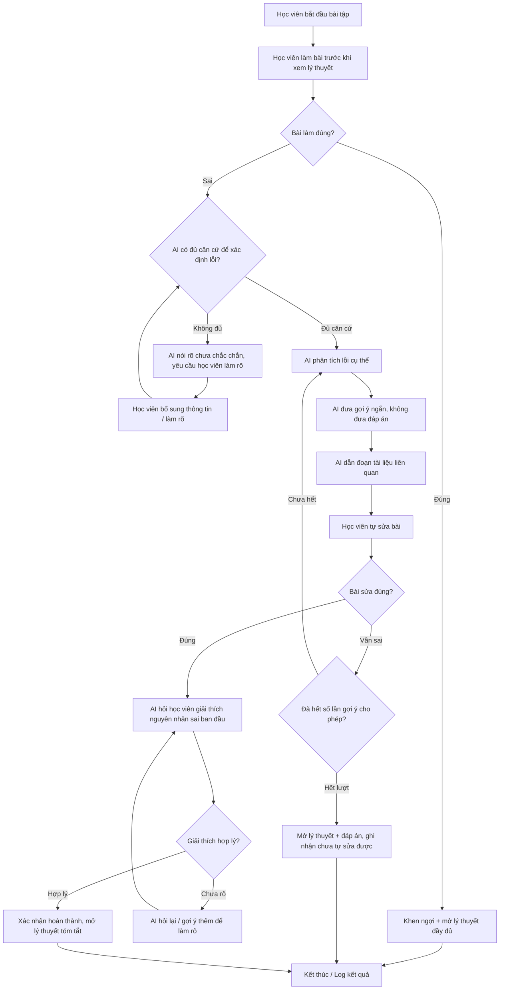

# Spec — Học từ lỗi trước (Prototype)

## 1. Phạm vi prototype
Một bài học, một dạng bài, một luồng xử lý lỗi duy nhất (theo mục 5 của tổng quan dự án). Không xử lý nhiều chương, không chấm điểm chính thức, không tự động đưa đáp án ngay khi sai.

## 2. Đối tượng dữ liệu (data model)

| Đối tượng | Trường chính | Mô tả |
|---|---|---|
| `Exercise` (bài tập) | id, đề bài, đáp án chuẩn, rubric chấm | Bài tập duy nhất dùng trong prototype |
| `Document` (tài liệu) | id, tiêu đề, nội dung, đoạn/section id | Nguồn để AI trích dẫn khi gợi ý |
| `Attempt` (lượt làm) | id, học_viên_id, bài_làm, đúng/sai, lần thứ mấy | Mỗi lần học viên nộp bài (làm đầu tiên + các lần sửa) |
| `ErrorAnalysis` (phân tích lỗi) | attempt_id, loại lỗi, mức độ tin cậy, căn cứ | Kết quả AI phân tích, có cờ "không đủ căn cứ" |
| `Hint` (gợi ý) | attempt_id, nội dung gợi ý, mức độ chi tiết, document_ref | Gợi ý ngắn, luôn gắn với 1 đoạn tài liệu |
| `Explanation` (giải thích) | attempt_id, nội dung học viên viết, đánh giá hợp lý/chưa | Dùng để kiểm tra học viên hiểu bản chất |
| `SessionLog` (log phiên) | session_id, các bước đã qua, thời gian mỗi bước, kết quả cuối | Phục vụ đo lường mục 8, không chứa dữ liệu cá nhân |

## 3. Các bước xử lý AI (theo luồng hoạt động)

1. **Chấm bài** — so khớp/áp rubric, trả về đúng/sai.
2. **Kiểm tra đủ căn cứ** — AI chỉ tiếp tục phân tích nếu có đủ dữ liệu (đề bài + đáp án chuẩn + bài làm + tài liệu liên quan). Nếu thiếu, trả lời "chưa chắc chắn" và hỏi lại, không suy đoán.
3. **Phân tích lỗi cụ thể** — AI xác định *loại* lỗi (ví dụ: hiểu sai khái niệm, nhầm công thức, thiếu bước, lỗi tính toán...), không chỉ nói "sai".
4. **Sinh gợi ý ngắn** — 1 gợi ý/lần, không lộ đáp án, độ chi tiết tăng dần theo số lần thử lại (lần 1 gợi ý mơ hồ hơn lần 2, 3).
5. **Trích dẫn tài liệu** — mỗi gợi ý phải kèm tham chiếu đến đoạn tài liệu cụ thể (id/section), không chỉ nói chung chung "xem lại bài học".
6. **Kiểm tra bài sửa** — so với đáp án/rubric.
7. **Kiểm tra giải thích** — AI đánh giá học viên có nêu đúng *nguyên nhân* sai ban đầu hay không (không chỉ lặp lại đáp án đúng).
8. **Ghi log** — lưu toàn bộ luồng cho một phiên để phục vụ đo lường.

## 4. Thiết kế prototype và giới hạn cần chốt

### Mức prototype nhắm tới: Mock

Prototype nhắm tới mức **Mock**: người dùng đi hết được luồng một bài tập từ làm bài, nhận phản hồi, xem gợi ý và tự sửa. Mục tiêu của bản Mock là kiểm tra quyết định thiết kế và hành vi học tập, không phải xây toàn bộ VLearn.

| Thành phần | Trạng thái trong prototype | Mô tả |
|---|---|---|
| Màn hình bài tập, ô nhập bài làm, nút nộp và nút sửa | Chạy thực tế | Người dùng có thể nhập câu trả lời, nộp bài và đi qua các trạng thái của flow. |
| Một bài tập và tài liệu của một bài học | Chạy thực tế | Dùng fixture nhỏ, đã ẩn danh, gồm đề bài, đáp án chuẩn và các đoạn tài liệu có mã section. |
| Kiểm tra đúng/sai cơ bản | Chạy thực tế | Dùng đáp án chuẩn hoặc rubric cố định cho đúng bài tập trong prototype. |
| Phân tích lỗi, sinh gợi ý và yêu cầu giải thích | Mock ở CP2; AI thật ở CP3 | CP2 có thể dùng kết quả mẫu để kiểm tra flow. Trước CP3 phải thay phần lõi này bằng ít nhất một lời gọi AI thật. |
| Trích dẫn đoạn tài liệu | Mock dữ liệu ở CP2; dữ liệu thật của fixture ở CP3 | CP2 hiển thị citation mẫu có mã section; CP3 kiểm tra AI chọn đúng đoạn từ fixture. |
| Ghi log phiên học | Chạy thực tế ở mức tối thiểu | Lưu trạng thái, số lượt gợi ý và kết quả cuối; không lưu tên hoặc dữ liệu cá nhân. |

### Giới hạn và tham số cấu hình

- `MAX_HINTS`: tối đa 2 gợi ý trước khi mở đáp án và lý thuyết tóm tắt.
- `CONFIDENCE_THRESHOLD`: chỉ phân tích lỗi khi AI có đủ căn cứ từ đề bài, bài làm và tài liệu fixture.
- `EXPLANATION_RUBRIC`: giải thích phải nêu đúng nguyên nhân sai ban đầu, không chỉ chép lại đáp án đúng.
- Chỉ triển khai một bài tập, một loại lỗi chính và một luồng sửa bài trong bản demo.

## 5. Chỉ số đo lường (theo mục 8 tổng quan dự án)
| Chỉ số | Cách đo |
|---|---|
| Độ chính xác xác định lỗi | So sánh loại lỗi AI đưa ra với nhãn do nhóm gán tay (golden set) |
| Tỷ lệ tự sửa được sau gợi ý | Số `Attempt` sửa đúng / tổng số lượt sai ban đầu |
| Tỷ lệ giải thích được nguyên nhân | Số `Explanation` được đánh giá hợp lý / tổng số lượt sửa đúng |
| Độ chính xác trích dẫn tài liệu | Kiểm tra thủ công đoạn tài liệu AI dẫn có đúng liên quan không |
| Thời gian từ sai → hiểu & sửa được | Chênh lệch thời gian giữa `Attempt` đầu tiên và `Attempt` sửa đúng cuối cùng |

## 6. Golden set và nguyên tắc HAX/PAIR

### Golden set (cần cho CP4/CP5)

- Tập câu trả lời sai mẫu, gồm ít nhất các trường hợp: không biết khái niệm, thiếu bước, nhầm công thức và câu trả lời mơ hồ.
- Mỗi case có nhãn loại lỗi, gợi ý mong đợi, đoạn tài liệu đúng và hành vi mong đợi khi AI không đủ căn cứ.
- Dùng cùng một bộ case để đo độ chính xác của AI trước demo; không thay đổi tiêu chí đạt sau khi đã xem kết quả.

### Bốn nguyên tắc HAX/PAIR áp dụng trong prototype

| Nguyên tắc | Cách áp dụng cụ thể | Vị trí áp dụng |
|---|---|---|
| **G1 — Làm rõ hệ thống làm được gì** | Màn hình đầu nói rõ đây là một bài luyện tập, AI chỉ hỗ trợ phân tích lỗi và gợi ý; không phải chấm điểm chính thức. | Màn hình bắt đầu bài tập và phần giới thiệu trong `codebase/luong-hoat-dong.md` bước 1. |
| **G2 — Làm rõ hệ thống làm tốt đến đâu** | Mỗi phản hồi hiển thị loại lỗi, mức độ căn cứ và mã đoạn tài liệu; nếu chưa đủ căn cứ thì nói rõ “chưa chắc chắn”. | Nhánh kiểm tra căn cứ và màn hình phản hồi sau khi làm sai, bước 3–6 của flow. |
| **G9 — Sửa dễ dàng** | Học viên được nhập bài sửa và gửi lại sau mỗi gợi ý; không phải bắt đầu lại phiên học. | Nút “Sửa bài” và vòng lặp `K → L → M → H` trong sơ đồ flow. |
| **G10 — Thu hẹp phạm vi khi nghi ngờ** | Khi thiếu dữ liệu hoặc lỗi không rõ, AI không đoán; AI yêu cầu học viên làm rõ hoặc chuyển sang xem tài liệu/đáp án. | Nhánh “Không đủ căn cứ” từ `E → F → G` và nhánh hết lượt gợi ý `M → N`. |

Các nguyên tắc trên được kiểm tra bằng golden set và trong phiên dùng thử: người quan sát ghi nhận người học có hiểu phạm vi, thấy nguồn, sửa được bài và nhận ra trường hợp AI không chắc chắn hay không.

## 7. Việc chưa hoàn thành (điền tiếp trước CP4)
- [ ] Chốt rubric chấm bài tập.
- [ ] Chốt rubric đánh giá giải thích hợp lý.
- [ ] Hoàn thiện golden set (số lượng mẫu tối thiểu).
- [ ] Thiết kế giao diện phần hiển thị gợi ý + trích dẫn.
- [ ] Kịch bản test với 2+ willing user (theo CP1).

## 8. Ràng buộc từ phạm vi không làm
- Không xây toàn bộ nền tảng VLearn, chỉ 1 bài/1 dạng bài.
- Không tự động chấm điểm chính thức (chỉ chấm đúng/sai phục vụ luồng gợi ý).
- Không đưa dữ liệu cá nhân hoặc dữ liệu gốc khóa học vào repo công khai — `SessionLog` phải được ẩn danh hoá.

## 9. Luồng hoạt động chi tiết

### Mô tả các bước

| Bước | Vai trò | Input | Output |
|---|---|---|---|
| 1. Làm bài trước lý thuyết | Học viên | Đề bài | Bài làm |
| 2. Chấm đúng/sai | Hệ thống | Bài làm, đáp án chuẩn | Đúng / Sai |
| 3. Kiểm tra căn cứ | AI | Bài làm sai, dữ liệu liên quan | Đủ / Không đủ căn cứ |
| 4. Phân tích lỗi | AI | Bài làm sai, đáp án, tài liệu | Loại lỗi cụ thể |
| 5. Gợi ý ngắn | AI | Loại lỗi | Một gợi ý, không phải đáp án |
| 6. Dẫn tài liệu | AI | Loại lỗi | Đoạn tài liệu có mã section |
| 7. Tự sửa | Học viên | Gợi ý và tài liệu | Bài sửa |
| 8. Kiểm tra bài sửa | Hệ thống/AI | Bài sửa | Đúng / Sai |
| 9. Kiểm tra giải thích | AI | Câu giải thích của học viên | Hợp lý / Chưa hợp lý |
| 10. Kết thúc | Hệ thống | Kết quả toàn bộ luồng | Log và lý thuyết phù hợp |

### Điều kiện dừng

- Tối đa 2 lượt gợi ý trước khi mở đáp án và lý thuyết tóm tắt.
- Nếu thiếu căn cứ, AI nói rõ chưa chắc chắn và yêu cầu làm rõ.
- Nếu học viên sửa đúng nhưng giải thích chưa hợp lý, AI hỏi lại trước khi kết thúc.
- Log chỉ lưu trạng thái phiên, số lượt gợi ý và kết quả; không lưu dữ liệu cá nhân.
