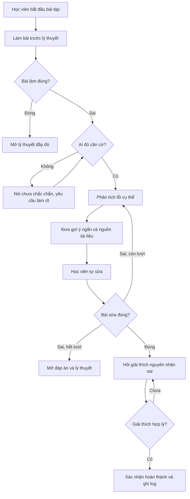

# Spec — Học từ lỗi trước (Prototype)

## 1. Phạm vi prototype
Một bài học, một dạng bài, một luồng xử lý lỗi duy nhất. Không xử lý nhiều chương, không chấm điểm chính thức, không tự động đưa đáp án ngay khi sai.

## 2. Đối tượng dữ liệu

| Đối tượng | Trường chính | Mô tả |
|---|---|---|
| `Exercise` | id, đề bài, đáp án chuẩn, rubric chấm | Bài tập duy nhất |
| `Document` | id, tiêu đề, nội dung, section id | Nguồn để AI trích dẫn |
| `Attempt` | id, bài làm, đúng/sai, lần thứ mấy | Lượt làm đầu và lượt sửa |
| `ErrorAnalysis` | attempt_id, loại lỗi, độ tin cậy, căn cứ | Kết quả phân tích lỗi |
| `Hint` | attempt_id, nội dung, document_ref | Gợi ý gắn với nguồn |
| `Explanation` | attempt_id, nội dung, đánh giá | Kiểm tra học viên hiểu bản chất |
| `SessionLog` | session_id, các bước, thời gian, kết quả | Log ẩn danh để đo lường |

## 3. Các bước xử lý AI

1. Chấm bài theo đáp án hoặc rubric.
2. Kiểm tra đủ căn cứ từ đề bài, đáp án, bài làm và tài liệu.
3. Phân tích loại lỗi cụ thể.
4. Sinh một gợi ý ngắn, không lộ đáp án.
5. Trích dẫn đoạn tài liệu có mã section.
6. Kiểm tra bài sửa.
7. Kiểm tra học viên giải thích đúng nguyên nhân sai.
8. Ghi log phiên học ẩn danh.

## 4. Thiết kế prototype và giới hạn

### Mức prototype: Mock

Prototype mức **Mock** cho phép người dùng đi hết luồng một bài tập từ làm bài, nhận phản hồi, xem gợi ý và tự sửa.

| Thành phần | Trạng thái | Mô tả |
|---|---|---|
| Màn hình bài tập, nhập bài, nộp và sửa | Chạy thực tế | Người dùng đi qua được toàn bộ flow. |
| Một bài tập và tài liệu | Chạy thực tế | Dùng fixture nhỏ, ẩn danh, có mã section. |
| Kiểm tra đúng/sai | Chạy thực tế | Dùng đáp án hoặc rubric cố định. |
| Phân tích lỗi, gợi ý, yêu cầu giải thích | Mock ở CP2; AI thật ở CP3 | CP2 dùng kết quả mẫu; CP3 có ít nhất một AI call thật. |
| Trích dẫn tài liệu | Mock ở CP2; fixture thật ở CP3 | CP3 kiểm tra AI chọn đúng đoạn nguồn. |
| Log phiên học | Chạy thực tế tối thiểu | Không lưu tên hoặc dữ liệu cá nhân. |

Tham số: `MAX_HINTS` tối đa 2 lượt; `CONFIDENCE_THRESHOLD` yêu cầu đủ căn cứ; `EXPLANATION_RUBRIC` yêu cầu nêu đúng nguyên nhân sai, không chỉ chép đáp án.

## 5. Chỉ số đo lường

| Chỉ số | Cách đo |
|---|---|
| Độ chính xác xác định lỗi | So sánh với nhãn golden set |
| Tỷ lệ tự sửa | Số lượt sửa đúng / tổng lượt sai |
| Tỷ lệ giải thích đúng | Số giải thích hợp lý / số lượt sửa đúng |
| Độ chính xác trích dẫn | Kiểm tra đoạn AI dẫn có liên quan |
| Thời gian sửa và hiểu | Từ lần sai đầu đến lần sửa đúng |

## 6. Golden set và HAX/PAIR

Golden set gồm các câu trả lời sai mẫu: không biết khái niệm, thiếu bước, nhầm công thức và câu trả lời mơ hồ. Mỗi case có loại lỗi, gợi ý mong đợi, đoạn tài liệu đúng và hành vi khi AI không đủ căn cứ.

| Nguyên tắc | Cách áp dụng | Vị trí |
|---|---|---|
| **G1 — Làm rõ hệ thống làm được gì** | Nêu đây là bài luyện tập, AI hỗ trợ phân tích và gợi ý, không chấm điểm chính thức. | Màn hình bắt đầu bài tập. |
| **G2 — Làm rõ hệ thống làm tốt đến đâu** | Hiển thị loại lỗi, mức độ căn cứ và mã section; nói “chưa chắc chắn” khi thiếu căn cứ. | Phản hồi sau khi làm sai, bước 3–6. |
| **G9 — Sửa dễ dàng** | Cho nhập và gửi bài sửa sau mỗi gợi ý, không cần bắt đầu lại. | Nút Sửa bài và vòng lặp sửa bài. |
| **G10 — Thu hẹp phạm vi khi nghi ngờ** | Không đoán khi thiếu dữ liệu; yêu cầu làm rõ hoặc mở tài liệu/đáp án. | Nhánh Không đủ căn cứ và nhánh hết lượt gợi ý. |

## 7. Việc chưa hoàn thành

- [ ] Chốt rubric bài tập.
- [ ] Chốt rubric giải thích.
- [ ] Hoàn thiện golden set.
- [ ] Thiết kế giao diện gợi ý và trích dẫn.
- [ ] Test với ít nhất 2 willing user.

## 8. Ràng buộc

- Chỉ làm một bài và một dạng bài trong prototype.
- Không chấm điểm chính thức.
- Không đưa dữ liệu cá nhân hoặc dữ liệu gốc vào repo công khai.

## 9. Luồng hoạt động chi tiết

### Điều kiện dừng

- Tối đa 2 lượt gợi ý trước khi mở đáp án.
- Thiếu căn cứ thì nói rõ chưa chắc chắn.
- Giải thích chưa hợp lý thì hỏi lại.
- Log chỉ lưu trạng thái, số lượt gợi ý và kết quả; không lưu dữ liệu cá nhân.
