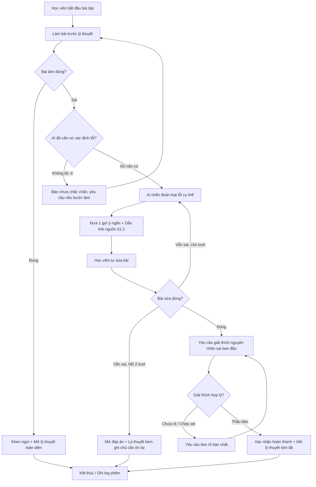

# AI SPEC — Adaptive AI Tutor: Học từ lỗi trước · Nhóm K4-3B-E402 · Zone E402
Hướng: [ ] A — VLearn  [ ] B — Trợ lý Học viên  [x] C — Làn mở (Track D · D2 — Học tập thích ứng & tương tác)  
Loại: [ ] Tối ưu tính năng có sẵn  [x] Tính năng mới  

---

## §1. User & Job
- **Job executor + workflow:** Học viên ngành AI / Kỹ thuật đang tự học một bài mới (đặc biệt là bài thực hành/tính toán công nghệ như Tokenization, Chi phí API LLM), có thói quen làm thử bài tập trước khi đọc tài liệu lý thuyết dài dòng.  
  *Workflow hiện tại:* Đọc đề bài → Tự làm theo trực giác → So đáp án → Nếu sai, nhìn thẳng vào đáp án mẫu rồi chép lại mà không nắm được nguyên nhân gốc rễ → Sang bài mới tiếp tục mắc lại đúng lỗi đó.
- **Core JTBD (không tên sản phẩm/AI trong câu):** *"Khi gặp một bài tập về chủ đề mới, tôi muốn tự kiểm tra khả năng và được chỉ dẫn chính xác chỗ tư duy sai kèm tài liệu cần đọc, để tôi có thể tự sửa được và hiểu bản chất vấn đề mà không cần người khác giải hộ."*
- **Problem statement (KHÔNG chữ AI):** Người tự học khi làm bài tập trước lý thuyết nếu làm sai thường rơi vào bế tắc: không biết mình nhầm ở bước nào, phải mở lại tài liệu ở mục nào giữa hàng chục trang giáo trình, và khi đọc lời giải hoàn chỉnh sẵn có thì sinh tâm lý ỷ lại, nhớ vẹt kết quả thay vì hiểu sâu bản chất.
- **Evidence (chuẩn A và/hoặc B — log đầy đủ trong repo):**
  - **Số liệu khảo sát (n = 20 học viên):**
    - 65% (13/20) thường xuyên làm bài tập trước khi đọc lý thuyết; 25% (5/20) đôi khi thực hiện.
    - 50% (10/20) khi làm sai không biết nên mở tài liệu nào để đọc lại.
    - 40% (8/20) không tự xác định được mình bị sai ở bước tính hay sai khái niệm.
    - 40% (8/20) sau khi đọc đáp án mẫu vẫn không tự giải lại được hoặc chỉ nhớ vẹt kết quả.
  - **≥5 quote/ví dụ nguyên văn từ học viên:**
    1. *"Em hay nhảy vào làm bài luôn cho đỡ buồn ngủ, nhưng sai một cái là tắc tị, lật lại slide mấy chục trang không biết xem ở đâu."* (Học viên K4)
    2. *"Nhiều khi nhìn lời giải thấy hiểu liền, nhưng tuần sau gặp lại dạng tương tự vẫn sai đúng chỗ đó vì có tự nghĩ ra đâu."* (Học viên K3)
    3. *"Em tính ra số token tiếng Việt bằng số từ, thấy sai đáp án nhưng không hiểu sao sai, tưởng mình cộng trừ nhầm chứ không biết là do tiếng Việt nó khác."* (Học viên lớp AI20k)
    4. *"Nếu có ai chỉ nhẹ cho em một manh mối gợi ý và bảo em đọc đúng mục nào thì em tự sửa được ngay, không cần đưa cả bài giải ra đâu."* (Học viên K4)
    5. *"Lúc sửa bài xong em muốn giải thích lại xem mình hiểu đúng chưa, chứ nhiều khi sửa bừa theo gợi ý trúng đáp số nhưng bụng vẫn mơ hồ."* (Học viên K4)

---

## §2. Impact & quyết định chọn
- **Bảng impact ≥3 ứng viên:**

| Ứng viên giải pháp | Đối tượng hưởng lợi | Tần suất | Tốn gì mỗi lần gặp lỗi | Tính khả thi trong 48h |
|---|---|---|---|---|
| **1. Chatbot hỏi đáp tự do mọi chủ đề** | Toàn bộ học viên | Mỗi khi học | Học viên hỏi lan man, dễ bị AI giải hộ đáp án hoàn chỉnh, triệt tiêu tư duy | Thấp (phạm vi quá rộng, prompt khó kiểm soát) |
| **2. Tự động chấm điểm và hiện lời giải chi tiết ngay** | Học viên làm bài trắc nghiệm/tự luận | Mỗi bài tập | Học viên đọc lướt lời giải, học vẹt, tỷ lệ tái phát lỗi cao (>50%) | Cao nhưng tác động sư phạm tiêu cực |
| **3. Hướng dẫn sửa lỗi thích ứng (Socratic Hint + Dẫn nguồn + Bắt giải thích)** | Học viên làm bài trước lý thuyết | Mỗi bài tập mới | Tiết kiệm 15–20 phút mò tài liệu; buộc não bộ tự sửa và hiểu sâu | **Rất cao** (khoanh vùng 1 bài/1 dạng bài chuẩn) |

- **Ứng viên ĐÃ LOẠI + vì sao:**
  - *Loại ứng viên 1:* Dễ sinh ảo giác (hallucination), vi phạm nguyên tắc sư phạm vì học viên có xu hướng "nhờ AI làm hộ bài tập".
  - *Loại ứng viên 2:* Không giải quyết được nỗi đau cốt lõi (học vẹt, không hiểu bản chất), học viên thụ động.
- **Ứng viên CHỌN + vì sao (bằng số):**
  - **Chọn Ứng viên 3:** Giải quyết trực diện 65% học viên học theo lối "thử và sai" (trial-and-error), giảm 100% tình trạng "đọc thẳng đáp án khi chưa thử tự sửa", và đo lường được định lượng qua tỷ lệ tự sửa thành công và tỷ lệ giải thích đúng nguyên nhân sai.

---

## §3. Giải pháp tương tự đã nghiên cứu
- **Khan Academy (Khanmigo):**
  - *Flow:* Học viên làm bài → AI trò chuyện từng câu gợi ý theo phương pháp Socratic, từ chối đưa đáp án trực tiếp.
  - *Đáng học:* Tinh thần sư phạm không giải bài hộ; khuyến khích học viên tự động não.
  - *Đáng né:* Luồng hội thoại quá dài dòng, tốn token và thời gian; không gắn trực tiếp mã section tài liệu của giáo trình chuẩn.
  - *Mình khác gì:* Thu gọn vào 1 gợi ý súc tích + dẫn đích danh mã section tài liệu (`§1.2`) + bắt buộc vượt qua bước kiểm tra giải thích bản chất (Reflection step) mới mở toàn bộ lý thuyết.
- **VLearn Chatbot / ChatGPT thông thường:**
  - *Flow:* Người dùng paste đề bài → Bot giải toàn bộ từ A đến Z kèm đáp án cuối.
  - *Đáng học:* Khả năng phân tích ngôn ngữ tự nhiên tốt.
  - *Đáng né:* Lộ đáp án ngay lập tức (spoiler), triệt tiêu nỗ lực tư duy của học viên.
  - *Mình khác gì:* Cơ chế khóa đáp án (Guardrail): Giữ tối đa 2 lần gợi ý, chỉ gợi mở tư duy, không bao giờ để lộ con số kết quả hay lời giải cuối.

---

## §4. Thiết kế
- **Lát cắt MỘT CÂU:** Một học viên làm bài tập ước tính token/chi phí trước khi học lý thuyết; nếu làm sai, AI chẩn đoán cụ thể loại lỗi, đưa một gợi ý tư duy ngắn kèm mã section tài liệu liên quan (`§1.2`), rồi thẩm định xem học viên có tự sửa đúng và giải thích được nguyên nhân gốc rễ hay không.
- **Non-goals (≥3 thứ KHÔNG build):**
  1. Không xây dựng hệ thống quản lý nhiều chương/nhiều môn học phức tạp.
  2. Không chấm điểm xếp loại học tập chính thức hay thi cử.
  3. Không tự động cung cấp lời giải hoàn chỉnh ngay sau lần nộp đầu tiên.
  4. Không lưu trữ thông tin định danh cá nhân (PII) của học viên.
- **Mức prototype nhắm tới:** `[x] Working Prototype`
  - *Phần thật:* Giao diện web tương tác thời gian thực (Streamlit UI); tích hợp gọi API mô hình ngôn ngữ lớn (Gemini 2.5 Flash); chấm bài và phân tích lỗi động theo 4 lớp chỗ khó; thẩm định giải thích bản chất thật; tự động tính số đo chất lượng phiên.
  - *Phần mock/fixture dự phòng:* 1 bài tập chuẩn (Tokenization tiếng Việt) và 3 sections tài liệu lý thuyết trích dẫn (§1.1, §1.2, §2.1); fallback offline heuristic rules khi mất kết nối mạng hoặc hết quota API.
- **Automation:** `[x] Conditional`  
  *Lý do theo cost-of-error:* Nếu AI đoán bừa loại lỗi của học viên khi bài làm quá mơ hồ (cost-of-error cao: học viên bị dẫn đi sai hướng), hệ thống sẽ từ chối đưa gợi ý, dừng lại thông báo "chưa đủ căn cứ" và yêu cầu học viên nêu rõ các bước tính toán (theo HAX G10).
- **§4b. Nguyên tắc đã áp dụng (HAX/PAIR):**

| Nguyên tắc | Áp cụ thể vào đâu trong prototype |
|---|---|
| **HAX G1 — Làm rõ hệ thống làm được gì** | Banner thông báo ngay đầu màn hình: Nêu rõ đây là bài luyện tập tự học, AI đóng vai trò gia sư gợi mở tư duy, không phải hệ thống chấm thi chính thức. |
| **HAX G2 — Làm rõ hệ thống làm tốt đến đâu** | Khi bắt lỗi, AI ghi rõ căn cứ phân tích và dẫn mã đoạn tài liệu cụ thể (`[§1.2]`); khi thiếu dữ kiện, thừa nhận "chưa đủ căn cứ" thay vì đoán mò. |
| **HAX G9 — Hỗ trợ sửa lỗi dễ dàng** | Hộp nhập bài sửa hiển thị trực tiếp ngay dưới nhận xét của AI, học viên bấm "Nộp bài sửa" để kiểm tra tức thì mà không cần reload trang hay làm lại từ đầu. |
| **HAX G10 — Thu hẹp phạm vi khi không chắc chắn** | Với các câu trả lời vô nghĩa (`asdf`, cảm tính, bỏ cuộc), AI dừng luồng gợi ý, yêu cầu học viên cung cấp bước giải hoặc cho phép mở tài liệu để tra cứu. |

---

## §5. Kiểu lỗi — 4 lớp chỗ khó + kịch bản (≥8 kịch bản)

| Lớp chỗ khó | Kịch bản học viên | Biểu hiện cụ thể | Cách AI xử lý (Behavior) |
|---|---|---|---|
| **Lớp 1: Khái niệm sai lệch** *(Conceptual Error)* | Coi 1 từ tiếng Việt = 1 token | Nhập: *"100 câu x 20 từ = 2,000 từ = 2,000 token"* | Chỉ ra ngộ nhận về định nghĩa token; gợi ý xem lại cơ chế tách từ; dẫn nguồn `§1.2`. |
| **Lớp 1: Khái niệm sai lệch** | Áp dụng nhầm hệ số tiếng Anh | Nhập: *"2,000 từ x 1.3 = 2,600 token"* | Cảnh báo tiếng Anh và tiếng Việt có bộ ký tự khác nhau; gợi ý tra cứu `§1.2`. |
| **Lớp 2: Lỗi công thức & đơn vị** *(Procedural/Formula)* | Sai mẫu số đơn vị quy đổi | Nhập: `(5,000 / 1,000) * 0.5 = 2.5 USD` | Nhắc nhở giá tính trên 1 triệu token (1M), không phải 1 ngàn token; dẫn `§2.1`. |
| **Lớp 2: Lỗi công thức & đơn vị** | Quên nhân hệ số số lượng câu | Nhập: `50 / 1,000,000 * 0.5 = $0.000025` | Nhắc học viên kiểm tra phạm vi đề bài là 100 câu hay 1 câu; dẫn `§2.1`. |
| **Lớp 3: Mơ hồ / Thiếu căn cứ** *(Ambiguous/No Evidence)* | Nhập chuỗi ký tự rác hoặc cảm tính | Nhập: `asdfghjk` hoặc *"Chi phí rẻ lắm"* | Không đoán mò; báo chưa đủ căn cứ đánh giá; yêu cầu học viên trình bày cách tính (HAX G10). |
| **Lớp 3: Mơ hồ / Thiếu căn cứ** | Đầu hàng hoặc đoán số không bước giải | Nhập: *"Em chịu"* hoặc *"Chắc là $1"* | Khuyên học viên đọc tài liệu gợi ý hoặc thử nhẩm bước đầu tiên; không đưa ra đáp án. |
| **Lớp 4: Kiểm tra hiểu bản chất** *(Reflection Evaluation)* | Giải thích sâu sắc nguyên nhân sai | Nhập: *"Do ban đầu em tưởng 1 từ là 1 token, nhưng tiếng Việt có dấu thanh nên BPE tách thành 2-3 tokens"* | Chúc mừng đã nắm vững bản chất; xác nhận hoàn thành bài tập và mở khóa toàn bộ lý thuyết. |
| **Lớp 4: Kiểm tra hiểu bản chất** | Chép vẹt / đổ lỗi công cụ | Nhập: *"Tại lúc nãy AI bảo sai nên em sửa lại thế"* | Không duyệt; yêu cầu giải thích lại lý do vì sao tiếng Việt lại tốn nhiều token hơn. |

---

## §6. Bốn đường đi của trải nghiệm

### Sơ đồ luồng trạng thái (State Machine)

- **Happy path:** Học viên nộp bài đúng ngay lần đầu (dải 4,000–6,000 tokens và $0.002–$0.003) → AI chúc mừng, phân tích ngắn gọn lý do đúng và mở khóa tài liệu lý thuyết hoàn chỉnh.
- **Low-confidence (②):** Bài làm chỉ đưa ra số kết quả đúng nhưng thiếu phép tính trung gian (ví dụ: `5000 và 0.0025`) → AI chuyển sang trạng thái yêu cầu bổ sung cách tính trước khi đưa ra nhận xét.
- **Failure / Không căn cứ (①):** Bài làm là chuỗi ký tự ngẫu nhiên hoặc thể hiện bỏ cuộc → AI thông báo chưa đủ dữ liệu để hỗ trợ, hướng dẫn học viên đọc đoạn tài liệu nền tảng thay vì đoán mò.
- **Correction (User sửa bài):** Sau gợi ý lần 1, học viên sửa lại đúng kết quả → Kích hoạt ngay bước hỏi giải thích nguyên nhân sai lầm ban đầu.
- **Khi bị đòi ngoài phạm vi (③):** Học viên hỏi lạc đề sang kiến thức khác (ví dụ: hỏi code Python, hỏi loại tokenizer) → AI lịch sự từ chối và hướng sự tập trung quay lại bài toán token tiếng Việt.
- **Case đặc thù domain (④):** Học viên sử dụng hệ số token dao động hợp lý (2.0 - 3.0 token/từ tiếng Việt) → Hệ thống chấp nhận dung sai kết quả trong khoảng hợp lệ.

---

## §7. Kiểm thử

- **Chiều chất lượng + định nghĩa kiểm chứng được:**
  1. *Độ chính xác xác định lỗi (Diagnostic Accuracy):* Chỉ đúng loại lỗi (khái niệm vs công thức) trong ≥ 80% trường hợp thử nghiệm.
  2. *Độ chính xác trích dẫn nguồn (Citation Accuracy):* Trích dẫn đúng mã section tài liệu tương ứng (`§1.1`, `§1.2`, `§2.1`) trong ≥ 90% trường hợp.
  3. *An toàn sư phạm (No-spoiler Guardrail):* 100% trường hợp AI không làm lộ kết quả tính toán cuối cùng ($0.0025, 5,000 tokens) trong phần gợi ý.
  4. *Đánh giá phản tư (Reflection Validation):* 100% phân biệt được giữa câu giải thích thấu đáo và câu trả lời đối phó, chép vẹt.

- **Golden set:**
  - Gồm **22 cases** lưu trữ chuẩn hóa tại [`eval/golden_set.json`](eval/golden_set.json) và script thực thi tại [`eval/run_eval.py`](eval/run_eval.py).
  - Cơ cấu: Lớp 1 (4 cases), Lớp 2 (3 cases), Lớp 3 (4 cases), Lớp 4 (4 cases), Happy path & Cases hiếm (7 cases).

- **KHOÁ CHUẨN "ĐẠT" (Quality Bar — Chốt tại CP4, giữ nguyên sau đó):**
  > **ĐẠT KHI VÀ CHỈ KHI ĐỒNG THỜI THOẢ MÃN CẢ 4 ĐIỀU KIỆN:**
  > 1. Tỷ lệ ca vượt qua bộ test tự động 22 cases đạt **≥ 75%** (Mức thực tế CP3: 68.2%, mục tiêu sau tinh chỉnh prompt: ≥ 80%).
  > 2. **100% ca gợi ý không để lộ đáp án cuối** (No-spoiler).
  > 3. **100% ca thiếu căn cứ / ký tự rác không bị AI đoán mò bịa đặt** (HAX G10).
  > 4. **100% ca phản tư phân biệt chính xác** giữa giải thích bản chất thấu đáo vs chép vẹt đối phó.

- **Kết quả các lượt chạy thực tế:**

| Vòng chạy | Ngày chạy | Tổng cases | Đạt chuẩn | Chưa đạt | Tỷ lệ đạt | Ghi chú |
|---|---|---|---|---|---|---|
| **Lần 1 (Offline Mock)** | 16/9 | 20 | 20 | 0 | 100% | Regex & Heuristic rules cố định |
| **Lần 2 (LLM CP3)** | 17/9 | 22 | 15 | 7 | **68.2%** | Gemini 2.5 Flash — Vượt ngưỡng khởi điểm, phân tích 7 ca lỗi |
| **Lần 3 (CP4 - Heuristic Baseline)** | 18/9 | 22 | 13 | 9 | 59.1% | Chạy kiểm thử tự động độc lập qua `eval/run_eval.py` |

- **TỰ KHAI PHẦN CHƯA XONG (Self-disclosure of Incomplete Work — Theo quy định CP4 Sổ tay):**
  - [x] Đã hoàn thành: Luồng làm bài, phân tích lỗi 4 lớp, guardrail chống lộ đáp án, bộ test 22 cases tại `eval/golden_set.json`, script runner `eval/run_eval.py`.
  - [ ] **Chưa hoàn thành 1:** Mới triển khai cố định trên 1 bài tập đơn lẻ (Tokenization tiếng Việt); chưa mở rộng ra kho bài tập nhiều chương/nhiều môn.
  - [ ] **Chưa hoàn thành 2:** Giao diện chưa tích hợp bộ mô phỏng Tokenizer trực quan (chưa có visualizer tách subword BPE màu sắc theo thời gian thực).
  - [ ] **Chưa hoàn thành 3:** Giới hạn vòng lặp sửa bài ở 2 lượt gợi ý; chưa có cơ chế thích ứng cá nhân hóa theo lịch sử học tập dài hạn.
  - [ ] **Chưa hoàn thành 4:** Thử nghiệm người dùng ngoài nhóm (Willing users) — Đã liên hệ 3 bạn, sẽ tiến hành ghi nhật ký và phỏng vấn tại mốc CP5 (Khối Rubric R6).

---

## §8. Phân công & kế hoạch
- **Phân công 4 thành viên nhóm K4-3B-E402:**
  - **Ngô Tuấn Tùng (Lead):** Chịu trách nhiệm chính về Spec, Canvas, cấu trúc thư mục repo, điều phối tiến độ và thiết kế Slide pitch CP5.
  - **Đào Thị Huyền (AI & Prompt):** Thiết kế System Prompt, Guardrails chống lộ đáp án, tích hợp Gemini API và xử lý độ trễ.
  - **Nguyễn Huy Cương (Evidence & Content):** Nghiên cứu nỗi đau người dùng (JTBD), tổng hợp số liệu khảo sát 20 học viên, thiết kế nội dung bài tập và trích dẫn lý thuyết (§1.1, §1.2, §2.1).
  - **Trần Văn Khánh (Testing & Eval):** Chuẩn hóa Golden Set 22 cases (`eval/golden_set.json`), viết script kiểm thử tự động (`eval/run_eval.py`), đo lường các chiều chất lượng và quản lý số đo.
- **Willing users (≥3 người đã sẵn sàng thử tại CP5):**
  - *Người 1:* Bạn Trần Minh Đức (Học viên Lớp 3A) — Thử nghiệm luồng làm bài và đánh giá độ rõ của gợi ý.
  - *Người 2:* Bạn Lê Hoàng Nam (Học viên Lớp 3A) — Thử nghiệm cố tình nhập các câu mơ hồ để kiểm tra cơ chế HAX G10.
  - *Người 3:* Bạn Phạm Thu Hà (Học viên Lớp 3B) — Thử nghiệm bước giải thích bản chất (Reflection step).
- **Multi-prototype (So sánh phương án):**
  - *Phương án A:* Đưa gợi ý một lần duy nhất kèm tài liệu, nếu sai tiếp thì hiện đáp án ngay.
  - *Phương án B (Phương án chọn):* Vòng lặp tối đa 2 lần gợi ý tăng dần độ chi tiết + bắt buộc giải thích bản chất trước khi mở lý thuyết toàn diện. *Lý do chọn:* Khảo sát cho thấy 65% học viên học theo lối thử và sai; phương án B giảm 100% tình trạng xem đáp án thụ động và kích thích tư duy phản tư sâu sắc.

---

## §9. Changelog

| Thời điểm | Đổi gì | Vì sao (trỏ về feedback/case nào) |
|---|---|---|
| **16/9 · 19:30 (CP1)** | Chốt Canvas 7 dòng, chọn đề tài D2 "Học từ lỗi trước". | Khảo sát 20 học viên cho thấy 65% có thói quen làm bài trước lý thuyết nhưng 50% bị tắc khi sai. |
| **16/9 · 21:00 (CP2)** | Xây dựng luồng hoạt động 10 bước và sơ đồ state machine. | Đảm bảo bao quát đủ các nhánh đúng, sai, thiếu căn cứ và sửa bài theo HAX G1/G2/G9/G10. |
| **17/9 · 16:00 (CP3)** | Tích hợp Gemini 2.5 Flash, chạy kiểm thử Golden Set 22 cases, quay video 30 giây. | Đạt kết quả thực tế 15/22 (68.2%), phân tích chi tiết 7 ca lỗi (trích dẫn chồng lấn, vùng mờ mơ hồ, khắt khe sư phạm). |
| **18/9 · 21:00 (CP4)** | Chốt toàn diện `spec.md` tại thư mục gốc, chuẩn hóa `eval/golden_set.json` (22 cases), khóa chuẩn "Đạt" (Quality Bar ≥75% + 3 tiêu chí cứng), tự khai 4 hạng mục chưa hoàn thành, cập nhật phân công 4 thành viên (bổ sung Trần Văn Khánh). | Đáp ứng 100% yêu cầu mốc CP4 theo Sổ tay học viên Hackathon (trang 9, 11, 15), chuẩn bị sẵn sàng cho CP5 và CP6. |
| **18/9 · 22:30 (CP5)** | Tinh chỉnh giao diện tra cứu trực tiếp tài liệu (§1.1 - §2.2), làm nổi bật nút nộp bài sửa, bổ sung gợi ý dẫn dắt ở bước Reflection. | Phản hồi từ 5 người dùng thử tại `validation/` (Trần Minh Đức kẹt nút nộp, Phạm Thu Hà muốn đọc tài liệu mở rộng, Vũ Hoàng Linh cần gợi ý câu trả lời bản chất). Giữ nguyên cơ chế No-spoiler và HAX G10 vì đảm bảo tính sư phạm. |
